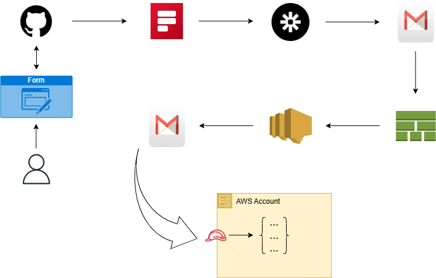

# An automated workflow for AWS access provisioning

## Purpose

The purpose of this project is to provide my Fiverr clients with an automated workflow to follow when purchasing any gig that requires access to their AWS environment. The challenges that this solution is designed to overcome are the following:

* Proof of the client's consent for access provisioning
* Secure access via the use of temporary credentials as opposed to permanent ones
* Automated deployment of the necessary resources in the client's AWS environment 
* Automated cleanup of the deployed resources once my work is done

## Prerequisites

* A GitHub account 
* A Formspree account with the professional plan
* A Zapier account with the professional plan
* A Gmail account

## Architectural diagram

**1)** After the purchase of a gig, the client is asked to fill in the [AWS Access Form](https://nick22d.github.io/aws-access-form/) which is hosted on GitHub pages.

**2)** Once the form is submitted, it gets transmitted to the Formspree endpoint for processing. At the same time, a notification is sent to my email address with the client's details. Formspree then forwards the client's information to an [incoming webhook](https://help.formspree.io/hc/en-us/articles/360036624813-Connecting-a-form-to-Zapier#:~:text=The%20first%20thing%20to%20do%20is%20to%20open,to%20events%20sent%20from%20Formspree%20on%20each%20submission) configured in Zapier. 

**3)** After Zapier receives the event, it takes the submitted information through a [formatter](https://help.zapier.com/hc/en-us/articles/8496312326285-Extract-data-in-Zaps#h_01HKMBZEYQZMPZGCCNV93A4MTM) in order to extract the client's email address.

**4)** With the client's email address extracted, Zapier then sends an email to the client containing instructions on how to deploy a CloudFormation stack based on the provided template which is hosted on an S3 bucket.

**5)** The client then imports the template and deploys it as a CloudFormation stack inside their AWS account as per instructions provided. The CloudFormation stack will deploy the IAM role necessary for access provisioning as well as an SNS topic.

**6)** Upon successful completion of the stack, the newly created SNS topic will send a notification to my email address.

**7)** Finally, I assume the IAM role created by the stack and carry out the necessary tasks using the role's temporary credentials. Once my work is done, I will sign out of the account and ask the customer to delete the CloudFormation stack which will in turn delete all associated resources, thereby revoking my access. 

